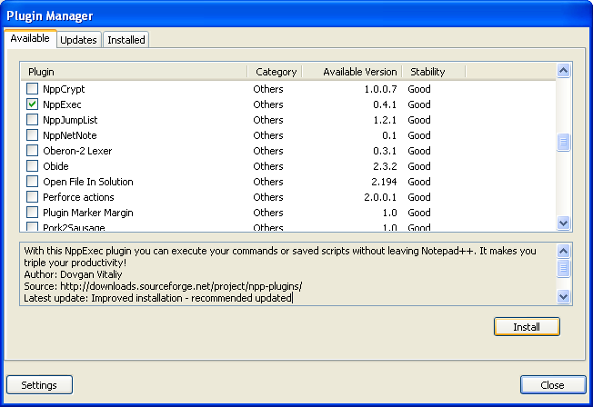
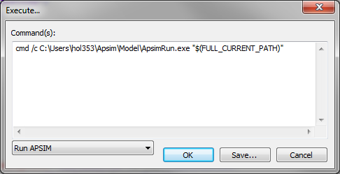
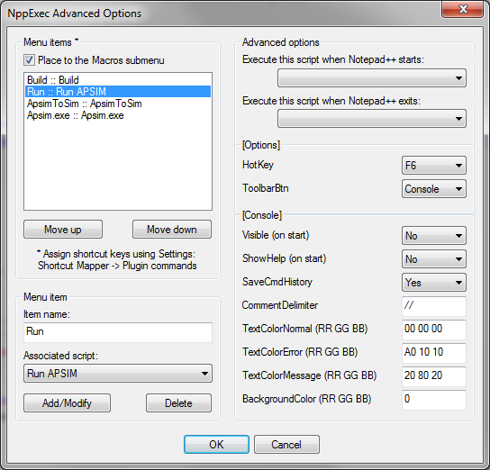
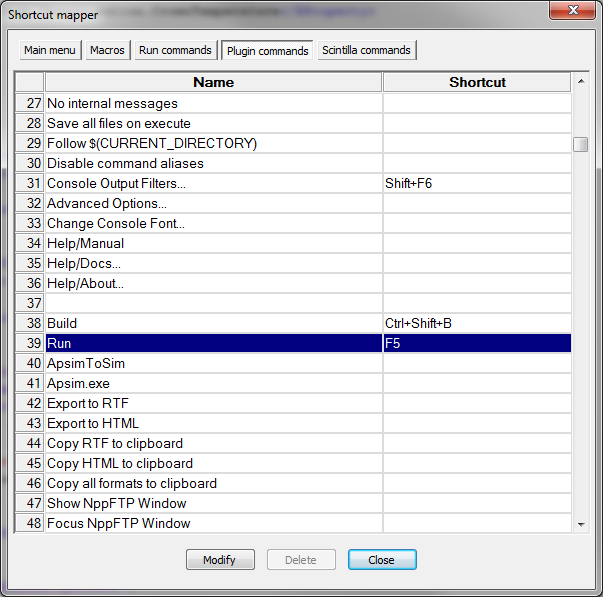

#Using NPP to compile and run APSIM
This page demonstates how to use the freely available Notepad++ to compile APSIM source code and run APSIM simulations.
#Installing Notepad++

-Install Notepad++ from the [Notepad++ web site.](http://notepad-plus-plus.org/ "Notepad++ web site.") 
-Ensure the NppExec plugin is installed by going to the **Plugins | Plugin Mangaer | 	Show Plugin Manger** menu and selecting NppExec:

#Setting up Notepad++ to run APSIM simulations

-To configure Notepad++ to execute external programs go to the Plugins | NppExec | Execute (F6) menu and type the command: cmd /c C:\Apsim\Model\Apsim.exe "$(FULL_CURRENT_PATH)", replacing c:\Apsim with your APSIM development path if you have it located in a different directory. Click Save and give it the name Run APSIM.

-To assign this RunAPSIM command to a menu, go to PlugIns | NppExec | Advanced options. Enter a menu item name Run. Select the associated script Run APSIM. Click Add. This will add a new menu to the Macro menu in Notepad ++.

-To assign this menu item to a key press (so that you can simply press F5 to run APSIM, go to Settings | Shortcut mapper, find the Run menu item under the Plugin commands tab and click Modify to give it the key press of your choice. F5 is a fairly standard run key press.

#Setting up Notepad++ to compile APSIM source code

-To compile APSIM source code follow the steps above setting up an Execute command of: $(CURRENT_DIRECTORY)\..\Build\RunMake.bat "$(CURRENT_DIRECTORY)" with a name of Compile APSIM and a menu command Compile. I use a shortcut key of CTRL SHIFT B which is the same as Microsoft Visual Studio.

-To get Notepad++ to highlight error messages from the compile, go to PlugIns | NppExec | Console Output Filters and enter these 2 filter lines:
*"%FILE%", line %LINE%:* 
%FILE%(%LINE%) : *

Now you can compile the file that you have open in Notepad++ by pressing CTRL SHIFT B. Any error message will be displayed in the window at the bottom. Double clicking an error message will take the editor to that line.

nb. If you have not done a complete build of APSIM yet using the method described in Building APSIM from source then you will probably get an error

 eg. such as:
C:\Apsim/Model/Build/WIN32VSFOR.make:9: C:\Apsim\Model\Build\VersionInfo.make: No such file or directory

The fastest way to fix this is to go to the Apsim Build System (aka BOB) and download the full "Build Tree" from the latest successful build.
Then unzip the entire Build Tree so that the "Apsim" folder is the parent folder. Then use this as your source code.

note that you have to have the third party tools and support libraries installed mentioned in Building APSIM from source

Alternatively you can do a complete build of APSIM using the method described in Building APSIM from source 
