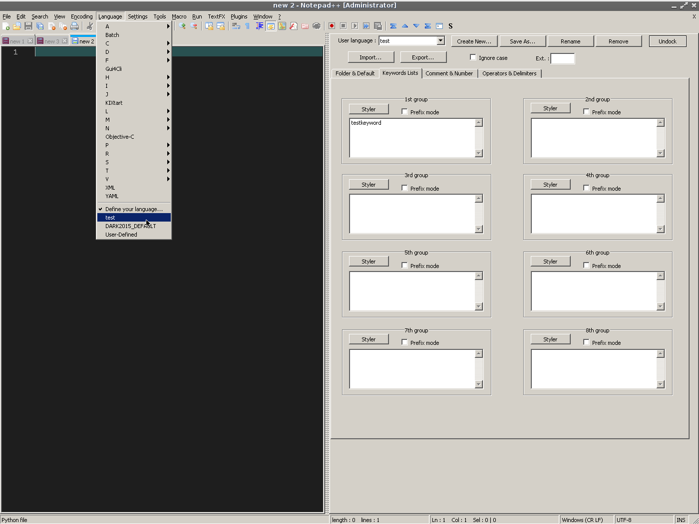
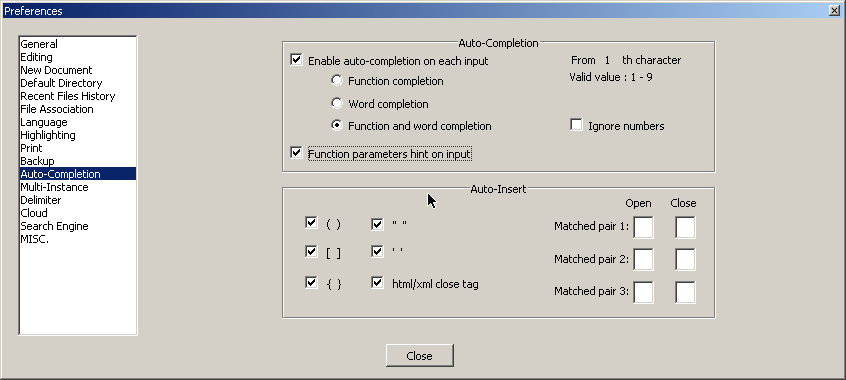
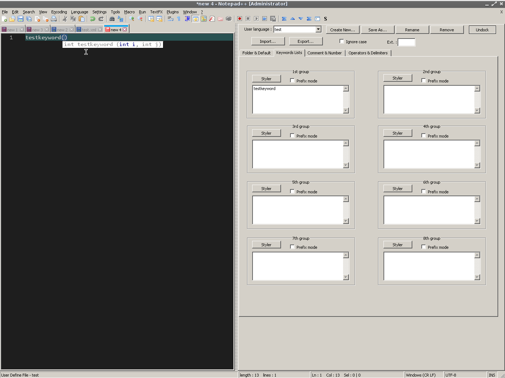

Custom AutoComplete file for XML language

Step 1: define the new language
Menu Language->Define your language…
open tab Keywords Lists
press Styker in 1st group
choose a foreground and background color if needed
put the word “testkeyword” (without quotes) into the textbox of 1st group
press Save As… button
put the name “test” in (without quotes)
check menu Language, you should see the language now

img1

Step 2: define API file
Open a new file - menu File->New
Put the following content into the file

[CODE]
<?xml version="1.0" encoding="Windows-1252" ?>
<NotepadPlus>
    <AutoComplete language="test">
        <Environment ignoreCase="yes" startFunc="(" stopFunc=")" paramSeparator="," terminal=";" />
        <KeyWord name="testkeyword" func="yes">
            <Overload retVal="int" >
                <Param name="int i" />
                <Param name="int j" />
            </Overload>
        </KeyWord>
    </AutoComplete>
</NotepadPlus>
[/CODE]

save it as C:\Program Files\Notepad++\plugins\APIs\test.xml
Step 3: Check Settings->Preferences->Atuo-Completion it should look like this

img2

Step 4: use it
open a new file - menu File->New
check language - menu Language->test
type the word “testkeyword” (without quotes)
you should see the word in a list, use tab key to complete
press key “(” (without quotes) and you should see the hints

img3

Cheers
Claudia